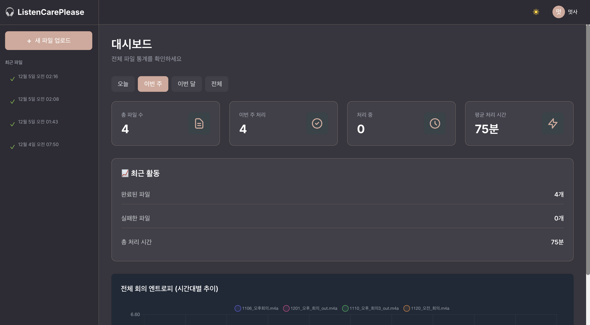
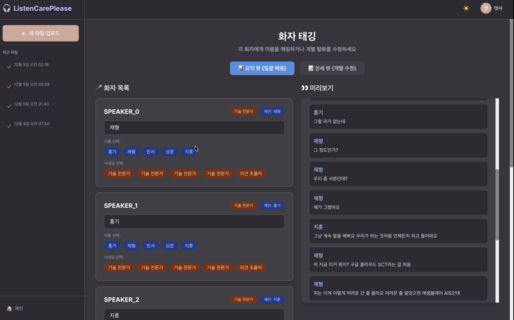
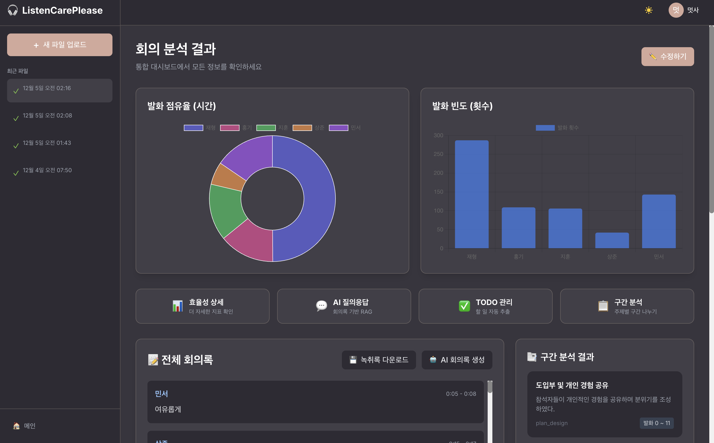
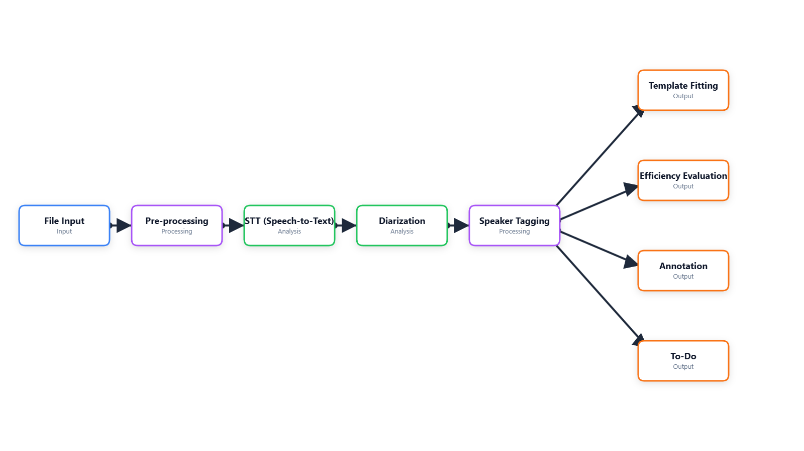

# ListenCarePlease 🎙️

**AI 기반 회의록 자동 생성 및 화자 태깅 서비스**

회의, 인터뷰, 팟캐스트 등의 음성 파일을 업로드하면 자동으로 화자를 분리하고 이름을 태깅하여 정리된 회의록을 생성하는 AI 기반 서비스입니다.

---

## 📌 프로젝트 소개

### 🧑‍💻 팀원 (Team)

| 이름 | 역할 |
|------|------|
| **이홍기** | 팀장 - 화자 분리, 화자 태깅, 웹 개발 |
| **김민서** | 화자 분리, 효율성 분석 |
| **박재영** | 키워드 추출, STT |
| **이상준** | 구간 분석, 닉네임 생성 |
| **정지훈** | AI 템플릿, TODO 추출 |

**팀 이름**: 내말을 들어조

### 🗓️ 프로젝트 기간
**2024년 11월 3일 ~ 2024년 12월 8일** (약 5주)

---

## 🖼️ 서비스 화면

### 메인 대시보드


### 화자 태깅 화면


### 회의록 결과


### 시스템 아키텍처


---

## 🚀 주요 기능

### 📄 **회의록 생성 + 키워드 추출**

#### 회의록 자동 생성 (Template Fitting)
- **2가지 분석 방식**
  - **단일 타입**: 전체 회의를 하나의 유형으로 분석
  - **섹션별 타입**: 주제 변화 지점 자동 감지 → 구간별 분석
- **6가지 회의 유형**
  - `informing` (정보 전달): 공지사항, Q&A 중심
  - `checking_syncing` (진행 점검): Planned vs Actual, Blockers
  - `problem_solving` (문제 해결): 문제 정의, 아이디어 탐색
  - `plan_design` (계획/설계): 목표, 산출물, 타임라인
  - `decide_commit` (의사결정): 공식 결정 및 근거
  - `relationship_review` (관계/피드백): 피드백, 감정 공유
- **자동 생성**: GPT-4o-mini 기반 summary, decisions, action_items

#### 키워드 자동 추출
- GPT-4o로 전문용어 자동 추출
- 동의어/오타 병합, 중요도 스코어링 (7점 이상만 사용)
- 비전공자용 용어집 자동 생성

---

### 🤖 **AI 기능: RAG + TODO + 템플릿**

#### RAG 기반 질의응답
- ChromaDB + LangChain 활용
- 회의 내용 기반 자연어 질문 → 정확한 답변 생성

#### TODO 자동 추출
- GPT-4o로 실행 가능한 할 일 자동 파싱
- 담당자, 마감일, 우선순위 자동 인식
- 상대적 날짜 변환 ("내일" → 실제 날짜)

#### AI 템플릿 관리
- 사용자 커스텀 회의록 템플릿 저장
- 재사용 가능한 구조화 양식

---

### 📊 **효율성 분석 (Dashboard)**

- **화자별 지표**
  - 발화 빈도, 총 발화 시간, 평균 발화 길이
  - TTR (어휘 다양성): Mecab 형태소 분석 기반
  - Information Content: Sentence Transformer 임베딩 거리
  - Perplexity: KoGPT-2 기반 문장 복잡도

- **전체 회의 지표**
  - 엔트로피, 침묵 시간 분석
  - Interaction Network: 화자 간 대화 패턴 시각화

- **정성 평가**
  - LLM 기반 회의 효율성 종합 평가

---

### 🎯 **핵심 음성 처리 파이프라인**

1. **STT (Speech-to-Text)**
   - OpenAI Whisper large-v3
   - 로컬/API 모드 지원
   - 청크 분할 (10분 단위) → 병렬 처리

2. **화자 분리 (Diarization)**
   - Senko (빠름) / NeMo (정확) 멀티 엔진 지원
   - 음성 임베딩 추출 (192차원)

3. **NER (이름 추출)**
   - Korean PII Masking BERT
   - Levenshtein 거리 기반 군집화

4. **화자 태깅 (LangGraph Agent)**
   - **하이브리드 매칭**: 음성 임베딩 + 텍스트 임베딩 (threshold: 0.85)
   - **멀티턴 LLM 추론**: GPT-4o-mini 기반 컨텍스트 인식
   - **소거법**: 1:1 매칭 시 자동 매핑
   - **닉네임 생성**: 역할/특징 기반 라벨링

5. **화자 프로필 DB**
   - 음성/텍스트 임베딩 저장 → 재사용

---

## 🛠️ 기술 스택

### Backend
- **Framework**: FastAPI + Uvicorn
- **AI/ML**
  - **LangChain + LangGraph**: Agent 워크플로우
  - **OpenAI GPT-4o / GPT-4o-mini**: 회의록 생성, TODO 추출, 키워드 분석
  - **Whisper large-v3**: STT
  - **Senko / NeMo**: Diarization
  - **Korean PII Masking BERT**: NER
  - **Sentence Transformers**: 텍스트 임베딩
  - **KoGPT-2**: Perplexity 계산
  - **KoNLPy + Mecab**: 형태소 분석
  - **ChromaDB**: Vector DB (RAG)
- **Database**: MySQL 8.0 + SQLAlchemy
- **Auth**: OAuth 2.0 (Google) + JWT
- **Export**: python-docx, openpyxl, reportlab

### Frontend
- **Framework**: React 18 + Vite
- **Styling**: Tailwind CSS
- **Visualization**: Chart.js, React Big Calendar
- **HTTP**: Axios
- **Routing**: React Router DOM v6

### Infrastructure
- **Docker**: Docker Compose v2
- **GPU**: NVIDIA CUDA 11.8 + cuDNN 8 (선택)

---

## 📂 프로젝트 구조

```
ListenCarePlease/
├── backend/                    # FastAPI 백엔드
│   ├── app/
│   │   ├── agents/            # LangGraph Agent 시스템
│   │   │   ├── graph.py       # 화자 태깅 그래프 (5단계)
│   │   │   ├── nodes/         # load_profiles, embedding_match, name_extraction, name_based_tagging, merge_results
│   │   │   ├── tools/         # voice_similarity, text_similarity (LangChain Tools)
│   │   │   ├── prompts/       # LLM 프롬프트 템플릿
│   │   │   ├── keyword_extraction_agent.py
│   │   │   └── template_fitting_agent.py
│   │   ├── api/v1/            # API 엔드포인트
│   │   │   ├── processing.py  # STT + Diarization
│   │   │   ├── tagging.py     # 화자 태깅
│   │   │   ├── todo.py        # TODO 관리
│   │   │   ├── efficiency.py  # 효율성 분석
│   │   │   ├── template.py    # 템플릿 관리
│   │   │   ├── keyword.py     # 키워드 관리
│   │   │   ├── rag.py         # RAG 질의응답
│   │   │   └── export.py      # 문서 내보내기
│   │   ├── services/          # 비즈니스 로직
│   │   │   ├── stt.py
│   │   │   ├── diarization.py
│   │   │   ├── ner_service.py
│   │   │   ├── nickname_service.py
│   │   │   ├── todo_extractor.py
│   │   │   ├── efficiency_analyzer.py
│   │   │   └── rag_service.py
│   │   ├── models/            # SQLAlchemy 모델
│   │   ├── schemas/           # Pydantic 스키마
│   │   └── main.py
│   └── requirements.txt
├── frontend/                  # React 프론트엔드
│   ├── src/
│   │   ├── pages/
│   │   │   ├── ProcessingPage.jsx
│   │   │   ├── TaggingPage.jsx
│   │   │   ├── ResultPageNew.jsx    # 회의록 + 키워드
│   │   │   ├── TodoPage.jsx         # TODO + RAG + 템플릿
│   │   │   └── EfficiencyPage.jsx   # 효율성 분석
│   │   └── components/
│   └── package.json
├── images/                    # README 이미지
│   ├── main_dashboard.png
│   ├── speaker_tagging.png
│   ├── meeting_result.png
│   └── system_architecture.png
└── docker-compose.yml
```

---

## 🎯 사용 플로우

### Phase 1: 기본 처리 (필수)
```
오디오 업로드 → 전처리 → STT → Diarization → NER → 화자 태깅
```

### Phase 2: 분석 기능 (선택)

| UI 화면 | 포함 기능 | 설명 |
|---------|----------|------|
| **📄 회의록 뷰** | 회의록 생성<br>키워드 추출 | Template Fitting으로 구조화<br>전문용어 자동 추출 |
| **🤖 AI 기능** | RAG 질의응답<br>TODO 추출<br>템플릿 관리 | 회의 내용 검색<br>할 일 자동 파싱<br>커스텀 템플릿 |
| **📊 효율성** | 화자별 분석<br>회의 효율성<br>상호작용 분석 | TTR, Perplexity<br>엔트로피, 침묵 분석<br>Network 시각화 |

---

## 🔑 핵심 시스템 아키텍처

### 화자 태깅 시스템 (LangGraph Agent)

**5단계 워크플로우**:

1. **load_profiles**: DB에서 사용자의 화자 프로필 로드
2. **embedding_match**: 음성(192차원) + 텍스트 임베딩 자동 매칭 (threshold: 0.85)
3. **name_extraction**: NER 결과에서 이름 추출 + 컨텍스트 수집
4. **name_based_tagging**: GPT-4o-mini 멀티턴 추론 (이름 전후 5문장 컨텍스트)
5. **merge_results**: 소거법 + 스코어 기반 최종 매핑 (신뢰도 0.7 미만은 수동 검토)

**LangChain Tools**:
- `calculate_voice_similarity`: 음성 임베딩 코사인 유사도
- `calculate_text_similarity`: OpenAI text-embedding-3-small 기반 스타일 매칭

---

### 템플릿 피팅 시스템

**섹션 자동 분할 알고리즘**:
- 주제 변화 지점 감지 → `start_index`, `end_index` 설정
- 각 Section별 회의 유형 자동 분류
- GPT-4o-mini로 `discussion_summary`, `decisions`, `action_items` 생성

**프롬프트 전략**:
- [Index] [Speaker] Text 형식으로 구조화
- 회의 유형별 TYPE_SPEC_HINTS 제공
- JSON 스키마 강제 출력

---

## 📡 주요 API 엔드포인트

### 파일 처리
- `POST /api/v1/upload`: 오디오 파일 업로드
- `POST /api/v1/processing/start`: STT + Diarization 시작
- `GET /api/v1/processing/status/{audio_file_id}`: 처리 상태 확인

### 화자 태깅
- `POST /api/v1/tagging/auto-match`: AI 자동 태깅
- `POST /api/v1/tagging/confirm`: 화자 매핑 확정

### 분석 기능
- `POST /api/v1/todo/extract/{audio_file_id}`: TODO 추출
- `GET /api/v1/efficiency/analyze/{audio_file_id}`: 효율성 분석
- `POST /api/v1/rag/query`: RAG 기반 질의응답
- `POST /api/v1/export/docx/{audio_file_id}`: Word 내보내기

자세한 API 문서: http://localhost:18000/docs

---

## 🚀 빠른 시작

### 1. 환경 변수 설정

프로젝트 루트에 `.env` 파일 생성:

```bash
# Database
MYSQL_ROOT_PASSWORD=your-root-password
MYSQL_DB=listencare
MYSQL_USER=listencare_user
MYSQL_PASSWORD=your-password

# OpenAI
OPENAI_API_KEY=sk-...

# OAuth (Google)
GOOGLE_CLIENT_ID=your-client-id.apps.googleusercontent.com
GOOGLE_CLIENT_SECRET=your-client-secret

# JWT
SECRET_KEY=your-secret-key-here
```

### 2. Docker로 실행

```bash
docker compose up --build
```

### 3. 접속

- **Frontend**: http://localhost:3000
- **Backend API**: http://localhost:18000
- **API Docs**: http://localhost:18000/docs

---

## 📊 데이터 흐름

```
오디오 파일 업로드
   ↓
전처리 (VAD, 노이즈 제거)
   ↓
STT (Whisper) → 단어별 타임스탬프
   ↓
Diarization → 화자별 임베딩 (192차원)
   ↓
NER → 이름 감지 + 컨텍스트
   ↓
LangGraph Agent
   ├─ 임베딩 매칭 (음성 + 텍스트)
   └─ 멀티턴 LLM 추론
   ↓
사용자 확정 → 최종 대본 저장
   ↓
분석 기능
   ├─ 📄 회의록 생성 + 키워드 추출
   ├─ 🤖 RAG + TODO + 템플릿
   └─ 📊 효율성 분석
```

---

## 🎮 CLI 모듈별 사용법

각 AI 기능을 **독립적으로** 커맨드라인에서 실행할 수 있습니다.

<details>
<summary><b>📝 STT (음성 → 텍스트)</b></summary>

```bash
python -m listencare.cli stt \
  --input audio.wav \
  --output transcript.txt \
  --model large-v3 \
  --device cuda
```

**출력 예시:**
```
[STT Step 1] 청크 분할...
✅ 3개 청크 생성
[STT Step 2] Local Whisper 전사 (모델: large-v3, 디바이스: cuda)...
✅ 전체 전사 완료 (45.2초)
✅ Transcript saved to transcript.txt
```

</details>

<details>
<summary><b>🎤 화자 분리 (Diarization)</b></summary>

```bash
python -m listencare.cli diarize \
  --input audio.wav \
  --model senko \
  --output diarization.json
```

**출력 예시:**
```json
{
  "turns": [
    {"speaker_label": "speaker_00", "start": 0.0, "end": 5.2},
    {"speaker_label": "speaker_01", "start": 5.3, "end": 12.1}
  ],
  "embeddings": {
    "speaker_00": [0.1, 0.2, ...],
    "speaker_01": [0.3, 0.4, ...]
  }
}
```

</details>

<details>
<summary><b>🏷️ 화자 태깅 (LangGraph Agent)</b></summary>

```bash
python -m listencare.cli tag \
  --transcript transcript.json \
  --participants "김민서,이홍기,박재영" \
  --output tagged.json
```

**프로세스:**
1. 음성/텍스트 임베딩 매칭 (threshold: 0.85)
2. NER 기반 이름 추출
3. GPT-4o-mini 멀티턴 LLM 추론
4. 소거법 적용
5. 최종 매핑 (신뢰도 0.7 이상)

</details>

<details>
<summary><b>🔑 키워드 추출</b></summary>

```bash
python -m listencare.cli keywords \
  --text meeting.txt \
  --output keywords.json \
  --min-score 7
```

**출력 예시:**
```json
[
  {
    "clean_word": "STT",
    "glossary_display": "STT (Speech To Text)",
    "mean": "음성을 텍스트로 변환하는 기술",
    "importance": 9
  }
]
```

</details>

<details>
<summary><b>✅ TODO 자동 추출</b></summary>

```bash
python -m listencare.cli todo \
  --text meeting.txt \
  --date 2024-12-08 \
  --output todos.json
```

**출력 예시:**
```json
{
  "todos": [
    {
      "task": "README 최종 업데이트",
      "assignee": "이홍기",
      "due_date": "2024-12-09 18:00",
      "priority": "High"
    }
  ]
}
```

</details>

<details>
<summary><b>📋 템플릿 피팅 (회의록 구조화)</b></summary>

```bash
python -m listencare.cli template \
  --transcript meeting.json \
  --type plan_design \
  --mode section \
  --output structured_meeting.json
```

**옵션:**
- `--type`: informing, checking_syncing, problem_solving, plan_design, decide_commit, relationship_review
- `--mode`: single (단일 타입) / section (섹션별 분석)

</details>

<details>
<summary><b>📊 효율성 분석</b></summary>

```bash
python -m listencare.cli efficiency \
  --transcript meeting.json \
  --output analysis.json
```

**분석 항목:**
- 화자별 TTR, Information Content, Perplexity
- 전체 엔트로피, 침묵 시간
- Interaction Network (화자 간 상호작용)

</details>

<details>
<summary><b>🚀 전체 파이프라인 (한 번에 실행)</b></summary>

```bash
python -m listencare.cli pipeline \
  --input audio.wav \
  --participants "김민서,이홍기,박재영" \
  --meeting-type plan_design \
  --output-dir ./results
```

**처리 과정:**
```
오디오 업로드 → STT → Diarization → NER → 화자 태깅
→ 키워드 추출 → TODO 추출 → 템플릿 피팅 → 효율성 분석
```

</details>

---

## 🙏 감사의 말

- [OpenAI](https://openai.com) - Whisper, GPT
- [LangChain](https://langchain.com) / [LangGraph](https://langchain-ai.github.io/langgraph/)
- [FastAPI](https://fastapi.tiangolo.com)
- [React](https://react.dev)

---

**Made with ❤️ by ListenCarePlease Team**
