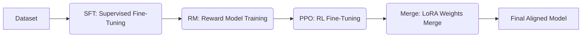

# RLHF-RAG-BASED-QA

> **Reinforcement Learning from Human Feedback (RLHF) Pipeline for RAG QA Models**

## Project Overview

본 프로젝트는 **Llama-3.2-1B** 모델을 기반으로 **RLHF(Reinforcement Learning from Human Feedback)** 파이프라인을 구축하여, 인간의 피드백을 반영한 고품질의 QA 모델을 학습시키는 연구/개발 프로젝트입니다.

SFT(지도 학습)부터 RM(보상 모델), PPO(강화 학습)에 이르는 전체 파이프라인을 구현하였으며, \*\*LoRA(Low-Rank Adaptation)\*\*와 **Quantization(4-bit)** 기술을 적용하여 효율적인 파인튜닝을 수행했습니다. 최종적으로 RAG(Retrieval-Augmented Generation) 시스템에서 사용자 질문에 대해 더욱 자연스럽고 정확한 답변을 생성하는 것을 목표로 합니다.

-----

## Training Pipeline

모델 학습은 다음의 4단계 프로세스를 통해 순차적으로 진행됩니다.



### 1\. SFT (Supervised Fine-Tuning)

  * **Role:** 기본 언어 모델(Base Model)의 지식 주입 및 답변 형식 학습
  * **Process:** Human-labeled 데이터셋을 사용하여 모델이 주어진 질문에 대해 일관적이고 유창한 답변을 생성하도록 지도 학습을 수행합니다.
  * **Key Tech:** Causal Language Modeling, QLoRA

### 2\. RM (Reward Model)

  * **Role:** 인간의 선호도(Human Preference)를 모방하는 평가자 모델 생성
  * **Process:** SFT 모델이 생성한 여러 답변 중 "더 인간적이고 유용한 답변"을 식별할 수 있도록 순위(Ranking) 데이터를 기반으로 보상 모델을 학습합니다.
  * **Key Tech:** Sequence Classification (Score output)

### 3\. PPO (Reinforcement Learning Fine-tuning)

  * **Role:** 보상 모델의 피드백을 통한 정책(Policy) 최적화
  * **Process:** **PPO(Proximal Policy Optimization)** 알고리즘을 사용하여, RM이 높은 점수를 부여하는 방향으로 언어 모델을 강화 학습합니다. 이를 통해 모델은 사람의 의도에 부합하는 답변을 생성하는 능력을 극대화합니다.

### 4\. MERGE (LoRA Merge & Save)

  * **Role:** 최종 모델 배포 준비
  * **Process:** 학습된 LoRA Adapter 가중치를 원본 Base Model에 병합(Merge)하여, 추론 시 별도의 어댑터 로딩 없이 사용할 수 있는 단일 모델로 저장합니다.

-----

## 📂 Project Structure

```bash
RLHF-RAG-BASED-QA/
├── SFT.py       # Supervised Fine-Tuning (기본 지도 학습 실행 스크립트)
├── RM.py        # Reward Model Training (보상 모델 학습 스크립트)
├── PPO.py       # PPO Reinforcement Learning (강화 학습 수행 스크립트)
├── MERGE.py     # LoRA Weights Merging (최종 모델 병합 및 저장)
└── README.md    # Project Documentation
```
-----
## 🛠 Model & Configuration

본 프로젝트는 효율적인 리소스 활용을 위해 경량화된 최신 모델과 양자화 기술을 활용했습니다.

| Category | Details |
| :--- | :--- |
| **Base Model** | `meta-llama/Llama-3.2-1B` |
| **Tokenizer** | Hugging Face Transformers Tokenizer |
| **Optimization** | LoRA (Low-Rank Adaptation) |
| **Quantization** | BitsAndBytes (4-bit, nf4 type) |
| **Library** | `transformers`, `peft`, `trl`, `bitsandbytes` |

-----

## 📜 License & Disclaimer

  * **License:** This project is for **research and educational purposes**.
  * **Source:** All pretrained models used in this project are sourced from publicly available repositories (e.g., Hugging Face).
  * 본 프로젝트의 결과물은 상업적 이용 시 베이스 모델의 라이선스 정책을 따라야 합니다.

-----

### 💡 Next Step

Would you like me to create a `requirements.txt` file based on the libraries mentioned in this README, or generate a dummy Python script for `SFT.py` to get you started with the code structure?
